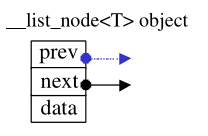

# STL源码剖析

## list

list每次插入或者删除元素，就配置一个或者释放一个元素空间

对任何位置的元素进行插入或者删除，都是`O(1)`

list的节点结构

```c++
template<class T>
struct __list_node{
    typedef void* void_pointer;
    void_pointer prev;
    void_pointer next;
    T data;
}
```



list是一个双向链表，迭代器必须具备前移和后移的能力，迭代器在内部的设置采用了运算符重载的方法，参考了整数可以进行的操作。


注意：对`node`节点解引用，得到是整个node节点的结构体，包括：`prev、next、data`

为了符合STL规范“前闭后开”的特点，list在内部实现的环状链表的尾端添加了一个空白节点


这样一来就能够轻易实现以下几个函数

```c++
iterator begin(){return (link_type) ((*node).next);}     typedef __list_node<T>* link_type
iterator end(){return node;}      link_type node
bool empty() const {return node->next==node;}
size_type size() const {size_type result=0;
                        distance (begin(),end(),result);
                        return result;}
//取头节点的内容（元素值）
reference front(){return *begin();}
//取尾节点的内容（元素值）
reference back(){return *(--end());}
```

`find`和`insert`函数

```c++
list<T>::iterator ite=find(list.begin(),list.end(),value)
find()函数属于algorithm头文件中的内容，value表示寻找的值，返回一个迭代器
list.insert(ite,value);
insert插入函数，表示插入在当前迭代器之前
```

list的元素操作

```c++
//插入一个节点,作为头节点
void push_front()
//插入尾节点
void push_back()
//移除迭代器所指节点
void erase()
//移除头节点
void pop_front()
//移除尾节点
void pop_back()
//清除整个链表
void clear()
//将数值为value的所有元素移除
void remove()
//移除数值相同的元素，注意只有“连续而相同的元素”，才会被移除剩一个
void unique()
//将连续范围的元素从一个list移动到另一个（或者同一个）
list1.splice(iterator_pos,ite_first,ite_last)
//将两个经过升序排序的list合并到一个，另外一个会变成空的
list1.merge(list2)
//倒叙list
list.reverse()
//排序   list不能使用STL算法中的sort()，必须使用自己的sort()函数，因为STL算法中的sort(),只接受RandomAccessIterator,list的是BidirectionalIterator
list.sort()
```

